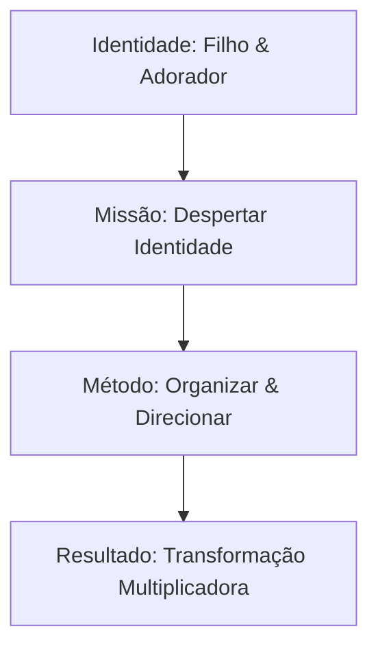

# Base de Dados de Identidade e Vocação - Felipe

Este documento funciona como uma base de dados estruturada que organiza todo o conhecimento sobre a identidade, história, valores, funcionamento mental e a cosmovisão do Felipe. Esta base servirá de fundamento para mapear e organizar os entregáveis de seus produtos futuros.

---

## 1. Perfil Geral e Eixo Central de Identidade



| Atributo | Descrição |
| :--- | :--- |
| **Identidade Primária** | Filho amado e adorador (prioridade de pertencimento sobre desempenho). |
| **Missão de Vida** | Despertar pessoas para sua identidade, organizar o potencial que carregam e enviá-las para impactar o mundo. |
| **Equação de Vida** | *“Quem eu sou, o que eu carrego e onde vou usar aquilo que carrego.”* |
| **Princípio de Operação** | Integração do sobrenatural com o cotidiano (não há separação entre o espiritual e o comum). |

---

## 2. Pilares de Identidade e Valores

### A. Âncora de Identidade
* **Filiação e Adoração**: A autoimagem do Felipe está ancorada no relacionamento vertical com Deus. O sucesso ou o fracasso não definem seu valor, mas sim o seu posicionamento como filho.
* **Espiritualidade Prática**: A manifestação do Reino de Deus ocorre de forma natural no dia a dia, seja liderando, ensinando, dirigindo à noite ou brincando com os filhos.

### B. Valores Inegociáveis (Ordem Sequencial)
1. **Amar a Deus**: O ponto de partida de todas as coisas.
2. **Andar na Verdade**: A verdade é validada por experiências concretas e relacionais (ex: casamento, paternidade), e não por teorias abstratas.
3. **Honrar e ser Leal**: Lealdade profunda às pessoas e aos princípios, por vezes estendida além do limite necessário por excesso de zelo.

---

## 3. A Cosmovisão: Arquitetura de Pensamento (Os 8 Níveis)

Felipe pensa em **sequência** e organiza a realidade e a transformação humana através de uma estrutura de 8 níveis progressivos:

| Nível | Nome | Descrição | Foco Principal |
| :--- | :--- | :--- | :--- |
| **1** | **Eternidade** | Macrovisão da existência | O panorama eterno de Deus. |
| **2** | **Reino** | Destino e propósito geral | O estabelecimento do governo de Deus na Terra. |
| **3** | **Identidade** | Quem nós somos | Resgate da filiação e autoconhecimento profundo. |
| **4** | **Governo Pessoal** | Emoções e Caráter | Autodomínio, inteligência emocional e maturidade. |
| **5** | **Descoberta dos Dons** | O que carregamos | Identificação das habilidades e recursos únicos. |
| **6** | **Expressão do Chamado** | Onde usamos | Aplicação prática e posicionamento no mundo. |
| **7** | **Influência** | Esferas de atuação | Impacto na sociedade, negócios, família e igreja. |
| **8** | **Multiplicação** | Preparar uma geração | Formação de novos líderes e perpetuação do legado. |

---

## 4. Habilidades Centrais e Modo de Funcionamento

### A. Transformador de Caos em Ordem (O Organizador Funcional)
Para Felipe, organizar não é apenas arrumar layouts ou planilhas; é **tornar algo funcional**. A habilidade essencial é traduzir a complexidade em simplicidade.

### B. O Processo de Ativação (Algoritmo de Atendimento)
Quando Felipe interage com alguém que precisa de direção, ele executa naturalmente o seguinte fluxo:
```
[Escutar] ➔ [Fazer Perguntas Chave] ➔ [Identificar a Raiz da Confusão] ➔ [Visualizar as Possibilidades] ➔ [Traduzir em um Caminho Simples]
```

### C. Orientação por Horizonte (Pensamento Estratégico)
* A mente do Felipe funciona respondendo a três perguntas contínuas:
  1. *Onde estou?*
  2. *Para onde vou agora?*
  3. *Qual é o próximo passo?*
* **Alimentação de Energia**: Ter clareza sobre o próximo horizonte gera energia e tração. A ausência de horizonte gera estagnação e perda de ritmo.

---

## 5. Dinâmica Interna: Forças vs. Vulnerabilidades

Abaixo estão listadas as dinâmicas de comportamento, forças internas e pontos de atenção/crescimento identificados.

```
                  ┌──────────────────────────────────────────┐
                  │           Estratégia e Visão             │
                  │  (Pensa em escala, legado, sistemas)     │
                  └────────────────────┬─────────────────────┘
                                       │
                              [ TENSÃO SAUDÁVEL ]
                                       │
                  ┌────────────────────▼─────────────────────┐
                  │          Obediência e Entrega            │
                  │   (Prontidão para seguir o direcionamento)│
                  └──────────────────────────────────────────┘
```

### A. Pontos Fortes e Motivadores
* **Construtor de Sistemas**: Facilidade para criar livros, métodos, cursos e processos que continuam multiplicando valor de forma independente.
* **Ativador de Identidade**: Foco em desbloquear o potencial oculto de pessoas que têm valor mas não o enxergam.
* **Orientação para o Futuro**: Preparação estratégica contínua de recursos (equipes, estruturas, capital) para o cumprimento da visão.

### B. Vulnerabilidades e Conflitos Internos
* **Medo de não sustentar o peso**: Contraste entre a grandeza da visão que recebe de Deus e a percepção da própria capacidade de carregar a responsabilidade ("Será que sou forte o suficiente para sustentar?").
* **Associação de Rejeição Relacional à Direção**: Tendência a interpretar a falta de ação ou de compromisso dos outros (mentorados, equipe, família) como desvalorização pessoal ou falha própria na entrega.
* **Medo de se perder no caminho**: Temor de que a obra ou o sucesso cresçam a ponto de se desconectarem do propósito e do favor de Deus.

### C. Crença Financeira Limitante vs. Combustível Financeiro
* **Mensagem da Infância**: *"Não tem dinheiro para isso."* (Gerou a percepção de limitação de horizontes na juventude).
* **Visão Atual**: Dinheiro não é o propósito, mas sim a **energia/acelerador** para cumprir o chamado e viabilizar a escala.
* **Desafio**: Evitar a crença de que *"enquanto não houver recursos financeiros abundantes, não posso avançar"*, permitindo que a visão cresça com os recursos já disponíveis.

---

## 6. A Jornada de Integração (O "Felipe do Mercado" vs. "Felipe do Reino")

Atualmente, Felipe vive um momento de transição e integração de duas identidades públicas que antes pareciam separadas:

1. **O Felipe do Mercado (Construído por sobrevivência e credibilidade)**:
   * Focado em tecnologia, processos, organização, plataformas de crescimento (XGrow), monetização e estratégias objetivas.
   * Nasceu da necessidade prática de "tirar a família do sofá" e construir segurança financeira.

2. **O Felipe do Reino (O coração e a essência)**:
   * Focado em filiação, adoração, ativação de identidade, discipulado, mentoria de vida e manifestação da verdade.
   * É onde a comunicação do Felipe se torna mais viva, fluida, espontânea e convincente.

> [!NOTE]
> **O Desafio da Próxima Fase:** Integrar o Felipe do Mercado ao Felipe do Reino. A tecnologia, a XGrow e a monetização não devem ser abandonadas, mas sim posicionadas como as **ferramentas** que servem à cosmovisão de ativação de identidade.

---

## 7. Posicionamento de Canal: Instagram

### A. Dados Atuais do Perfil
* **Username:** `@felipedamasceno.1`
* **Nome de Exibição:** *Felipe Damasceno | Tecnologia de Vendas Online*
* **Métricas Gerais (Referência):** ~11K seguidores | 31 seguindo | 43 publicações
* **Bio Atual:**
  > *"Preparo empresários a migrarem para o digital construindo um faturamento paralelo de 50 a 100k por mês com liberdade de tempo. Clique aqui 👇"*

### B. Análise de Alinhamento e Conexão com os Produtos
* **Foco da Promessa Atual:** O perfil hoje está fortemente posicionado para a **migração para o digital** e a geração de **faturamento paralelo (50k a 100k/mês)**.
* **Conexão com a Esteira de Produtos:**
  * **Alinhamento Direto:** Esta promessa conecta-se perfeitamente com os produtos **DNA Digital**, **Escala Digital** e **MAPA VND na Prática**, que focam em empacotar o conhecimento do especialista e montar a máquina de vendas no digital.
  * **Alinhamento Indireto / Oportunidade:** O produto **Potência Empresarial 180** (destinado a empresários tradicionais com equipe que querem sair do operacional) não está explicitado na promessa principal do Instagram. Para atrair esse público de alto valor (High Ticket de R$ 104k), o posicionamento do perfil precisará equilibrar a narrativa de "criar um negócio digital" com a de "tornar a empresa atual viva e independente do dono".
* **Conexão com a Identidade Central:**
  * A bio foca na promessa de resultado financeiro e liberdade (*Felipe do Mercado*).
  * O desafio de conteúdo é introduzir a cosmovisão de *Identidade, Sequência, Processos e Liderança* (*Felipe do Reino*) para que a autoridade de tecnologia seja o canalizador da ativação empresarial e de vida dos seguidores.
