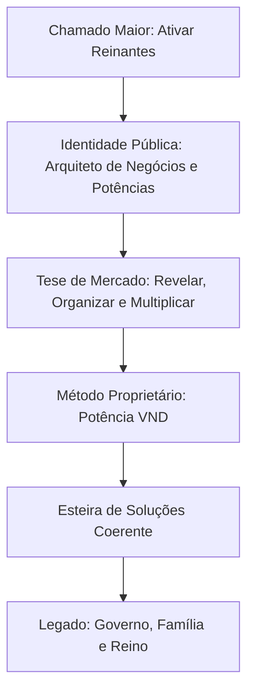

# Base de Dados do Sistema de Coerência - Felipe Damasceno

Este documento representa o plano diretor estratégico de marca, posicionamento, comunicação e oferta de Felipe Damasceno. Ele integra história, missão, produtos, ferramentas e monetização em uma verdade única, servindo como o guia principal para a criação de conteúdo, estruturação de propostas e modelagem de novos entregáveis.

---

## 1. Mapa Estratégico de Posicionamento



---

## 2. Os 15 Pilares do Sistema de Coerência

### 1. Clareza de Identidade (Quem eu sou?)
> **A Identidade Pública:**
> *Um homem que passou pelo processo de reconstrução, entendeu que conhecimento sem estrutura não transforma, e agora ajuda empresários, especialistas e líderes a organizarem sua verdade, sua operação e sua mensagem para crescerem com propósito, tecnologia e legado.*
* Felipe não vende apenas softwares ou implementações; ele extrai o potencial e a história da pessoa para transformá-los em negócios escaláveis (método, produto, operação, autoridade, entrega e legado).

### 2. Clareza da Tese Central (A Frase-Mãe)
> *“Todo empresário carrega uma potência que precisa ser revelada, organizada e multiplicada. Mas sem identidade, método, tecnologia e operação, essa potência vira peso, caos e frustração.”*
* **Objetivo de mercado:** Organizar e liberar a potência reprimida de pessoas chamadas para construir, liderar e multiplicar.

### 3. Clareza do Chamado Maior (A Fonte)
> *“Minha missão é ativar reinantes. Pessoas que entendem que empresa não é só faturamento, é governo, serviço, mordomia, família, educação e legado.”*
* **Posicionamento Religioso vs. Mercado:** O Reino de Deus atua como a **raiz silenciosa** de toda a conduta e estrutura, não como um slogan comercial religioso. Vende-se estrutura, clareza e implementação; entrega-se mordomia e governo.

### 4. Clareza do Público (Para quem?)
* **Perfil do Cliente Ideal:** Empresários, mentores, especialistas, consultores e infoprodutores que já possuem conhecimento real e vendas (ou potencial de vendas), mas estão afogados no caos operacional.
* **Dores Mapeadas:**
  * Conhecimento solto sem virar método.
  * Vendas artesanais, dependentes de indicação e sem previsibilidade.
  * Excesso de dependência do WhatsApp e improviso.
  * Ferramenta contratada sem operação integrada.
  * Chamado nítido sem estrutura prática de sustentação.

### 5. Clareza da Transformação (Qual resultado?)
> **A Promessa Emocional e Prática:**
> *“Ajudo empresários e especialistas a transformarem sua verdade em uma estrutura que vende, entrega, educa e deixa legado.”*
* **Foco:** Conduzir o cliente para fora do caos operacional e inseri-lo em uma operação organizada, posicionada e multiplicável.

### 6. Método Proprietário (Método Potência VND)
O passo a passo da transformação da alma à tecnologia:

| Fase | Etapa | Foco da Ação |
| :--- | :--- | :--- |
| **1** | **Revelar o DNA** | Resgate da história, verdade, chamado, autoridade e promessa única do cliente. |
| **2** | **Organizar o Método** | Transformar ideias em método estruturado, produto, oferta e esteira de entregáveis. |
| **3** | **Posicionar a Autoridade** | Ajustar bio, destaques, imagem percebida, narrativas de conteúdo e prova social. |
| **4** | **Estruturar a Operação** | Montar funil, CRM de vendas, fluxos de atendimento e gestão comercial. |
| **5** | **Multiplicar com Tecnologia** | Implementar a área de membros (VND OS), automações de mensagens e dashboards de KPIs. |
| **6** | **Governar com Legado** | Garantir que a empresa sirva à vida do dono, à família, aos clientes e ao Reino. |

### 7. Clareza da História (Os Capítulos da Narrativa)
A jornada do Felipe deve ser contada como um processo de autoridade e aprendizado prático:
1. **Antes:** Funcionário do setor bancário, estabilidade financeira, mas convicção de um chamado maior.
2. **Ruptura:** Visão de atuar com educação digital, pressão, erros operacionais, períodos de escassez e início da reconstrução.
3. **Processo:** Desenvolvimento de tecnologia, plataformas de educação (XGrow), faturamento expressivo e consolidação técnica.
4. **Virada:** Consciência de que conhecimento sem infraestrutura e processos gera estagnação.
5. **Missão Atual:** Ativar o potencial de líderes e empresários através da organização e tecnologia.
6. **Legado:** Fortalecer famílias, negócios estruturados e reinantes no mercado.

### 8. Clareza da Frase de Posicionamento (Frase de 5 segundos)
> *“Eu transformo conhecimento, história e chamado em negócios digitais estruturados para vender, educar e deixar legado.”*

### 9. Clareza da Esteira de Produtos
A organização sequencial dos produtos para o avanço do cliente:

```
[Entrada: Raio-X] ➔ [Clareza: DNA Digital] ➔ [Estrutura: VND Offer] ➔ [Implementação: Mapa VND] ➔ [Recorrência: Plataforma] ➔ [Premium: Potência 180]
```

* **1. Entrada — Diagnóstico:** *Raio-X / Diagnóstico VND* (Identifica gargalos em identidade, oferta, processo e tecnologia).
* **2. Produto de Clareza:** *DNA Digital / VND Position* (Extrai posicionamento, autoridade e linha de conteúdo).
* **3. Produto de Estruturação:** *VND Offer + Funnel + Jornada do Aluno* (Gera oferta, método e jornada de entrega).
* **4. Produto de Implementação:** *VND Expert / Mapa VND Completo* (Instalação prática de CRM, funis, automações e criativos).
* **5. Recorrência:** *Plataforma VND / VND OS / VND Sales IA* (O motor tecnológico rodando com CRM, IAs e dashboards).
* **6. Premium:** *Potência Empresarial 180 / Legado / Governança* (Cultura, formação de líderes, KPIs e retirada do dono do operacional).

### 10. Clareza da Mensagem Pública (Os 7 Pilares de Conteúdo)
1. **Verdade e Identidade:** Quem a pessoa é, seu chamado, essência e autoridade original.
2. **Jornada Real:** Bastidores, fé com sobriedade, família, acertos e aprendizados reais da reconstrução.
3. **Empresário Operacional:** O sofrimento do caos, falta de rotinas, CRM abandonado e dependência do fundador.
4. **Conhecimento para Produto:** Como estruturar mentorias, cursos e e-books a partir de sabedoria prática.
5. **Tecnologia Multiplicadora:** Tutoriais e discussões sobre IA, CRM, VND OS, automações e dashboards.
6. **Reino, Mordomia e Legado:** Governança, mordomia corporativa e empresas que servem à família e ao propósito.
7. **Provas e Implementação:** Cases, prints de resultados de clientes, telas de automação e transformações reais.

### 11. Clareza Estética e Simbólica
* **Arquétipo Visual:** Empresário sábio + arquiteto de negócios + homem de missão + implementador tecnológico.
* **Elementos Visuais:** Fluxos desenhados, quadros brancos, dashboards reais, notebooks com código/CRM, momentos de sobriedade com família e fé, cores premium e quentes.

### 12. Clareza da Prova
* Mapeamento de conquistas para validação de autoridade: Fundador da XGrow, R$ 200M+ em faturamento gerado para clientes, mais de 1 milhão de alunos impactados e centenas de operações estruturadas.

### 13. Clareza do Inimigo (Contra o que lutamos?)
* Luta ativa contra: o caos operacional, a mentira das aparências (ostentação rasa), o marketing digital sem alma, o desperdício de chamados/potencial, a venda sem entrega e as autoridades fabricadas.

### 14. Manifesto da Marca
> *“Eu acredito que existem empresários, especialistas e líderes carregando respostas que podem transformar famílias, empresas e gerações. Mas muitos estão presos no caos, na desorganização, na operação e na falta de clareza. Eu existo para ajudar essas pessoas a revelarem sua verdade, organizarem seu conhecimento e construírem uma estrutura capaz de vender, entregar, educar e multiplicar. Tecnologia, para mim, não é o fim. É uma ferramenta de mordomia. Negócio não é só faturamento. É governo, serviço e legado. Minha missão é ativar reinantes.”*

### 15. O que vendemos de verdade?
* **Clareza + Estrutura + Tecnologia + Execução** para organizar a potência individual e corporativa em um sistema multiplicável.

---

## 3. O Caminho Prático (Documentos-Mãe a Construir)

Para consolidar e materializar esta estratégia, devem ser redigidos os seguintes documentos estruturais:

1. **Mapa de Identidade:** História de reconstrução, crenças, inimigos e arquétipo de Felipe.
2. **Manifesto da Marca:** Roteiro e declaração visual do manifesto.
3. **Tese de Mercado:** Diagnóstico crítico do marketing digital tradicional vs. o Marketing da Autenticidade.
4. **Método Proprietário:** Manual conceitual das fases do Potência VND.
5. **Arquitetura de Produtos:** Níveis detalhados de oferta de cada produto (Preço, Escopo e Entregáveis).
6. **Mapa de Conteúdo:** Planejamento editorial baseado nos 7 pilares.
7. **Banco de Provas:** Repositório de depoimentos, cases e prints organizados.
8. **Página de Posicionamento:** Roteiro de texto para Landing Page institucional.
9. **Oferta Principal:** Detalhamento comercial da mentoria e software VND Expert.
10. **Ritual de Execução:** Agenda diária e semanal de Felipe para produção, vendas e entrega.
